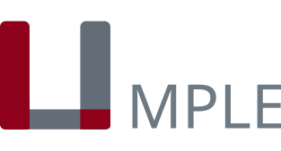

<div align="center">
  
</div>

# Umple Skills

AI skills for [Umple](https://www.umple.org) — diagrams, code, requirement tracing, validation, example mains, mixsets, and an orchestrator that chains those skills. Powered by the Umple Online API. No local dependencies required.

## Skills

### Diagram Generator

Describe what you want in plain English and get a clean SVG diagram back.

**Supported diagram types:**
- **Class diagrams** — classes, attributes, associations, inheritance, interfaces
- **State machine diagrams** — states, transitions, guards, actions, nested states, concurrent regions
- **ER diagrams** — entity-relationship diagrams for database modeling
- **Trait diagrams** — reusable trait definitions

**Example prompt:**
> Draw a class diagram for a university system with Students, Courses, and Professors. Students enroll in multiple courses, and each course has one professor.

### Code Generator

Describe your domain model and get complete, working code in your target language.

**Supported languages:**
- Java (full-featured, default)
- Python
- PHP
- Ruby
- C++ (real-time)
- SQL (CREATE TABLE DDL)
- JSON

Generated code includes constructors, getters/setters, association management methods, and state machine logic — no boilerplate to write.

**Example prompt:**
> Generate Java classes for a library system with Books, Members, and Loans. Members can borrow up to 5 books. Each loan tracks the borrow date and due date.

### Requirements Tracer

Turn labelled requirements into an Umple model tagged with `req` / `implementsReq`, or add those tags to an existing model. Compiles through the Umple Online API and can emit a Plain Requirements Doc to show what implements what.

**When it tags:**
- Small labelled requirements (IDs like `R01`, `REQ-101`, or a short numbered list) → **must** use `implementsReq`
- A massive unlabelled requirements dump → generate the model only, **do not** invent `implementsReq` mappings

**Example prompt:**
> Turn these into an Umple model and tag each feature: req R01 { A member has a name. } req R02 { A book has a title and ISBN. } req R03 { Members borrow many books. }

### Model Validator

Compile an `.ump` file and report errors plus Umple best-practice issues (duplicate associations, bad `implementsReq` IDs, reserved state names).

### Main Generator

Add a `public static void main` that constructs objects or fires state-machine events.

### Mixset Builder

Split a model with mixins, `mixset` / `use`, and multiple `.ump` files (product-line features).

### Feature Orchestrator

Routes a large request through the skills above (skills calling skills) so the agent can use more of the Umple language.

## Using with Claude

### Claude chatbot (claude.ai / Claude Desktop)

1. Download the skill zip files from the [**Releases page**](https://github.com/umple/umple-skills/releases/latest)
2. In Claude, go to **Settings > Capabilities > Skills**
3. Click **"+"** → **"Upload a skill"**
4. Upload the `.zip` file for each skill

Once uploaded, Claude will automatically use the skills when you ask for diagrams or code generation.

### Claude Code (CLI)

```bash
npx skills add umple/umple-skills
```

Skills include `/umple-diagram-generator`, `/umple-code-generator`, `/umple-requirements-tracer`, `/umple-model-validator`, `/umple-main-generator`, `/umple-mixset-builder`, and `/umple-feature-orchestrator`.

## How it works

All skills use the [Umple Online API](https://cruise.umple.org/umpleonline/) — no local tooling required. Each skill is self-contained:

```
<skill>/
├── SKILL.md         # Workflow — when and how to use the skill
└── references/      # Domain knowledge — Umple syntax and patterns
```

## Local development

```bash
git clone https://github.com/umple/umple-skills.git
cd umple-skills
./sync-skills.sh    # Sync skills to ~/.agents/skills
```

To build the zip files locally:

```bash
./build-zips.sh     # Outputs to dist/
```
